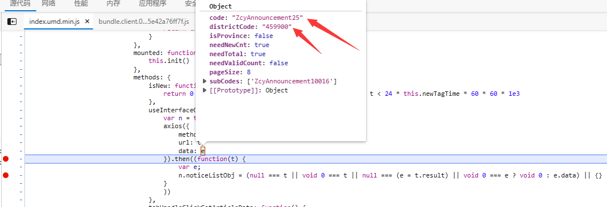
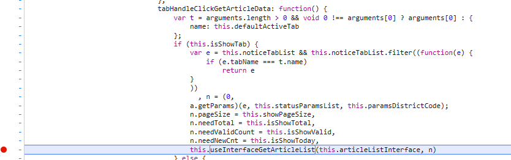
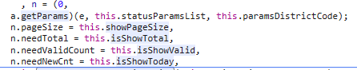
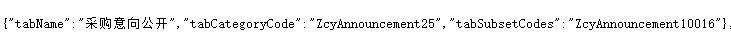

使用方法：
```
scrapy crawl itcast -o publicinfo.json
```
分析步骤：
经过初步分析，这个政府网站使用的是前后端分离模式（在源代码里面没有查找到相应的数据），然后打开抓包软件，查找相应的值，发现请求的url为
http://zfcg.gxzf.gov.cn/portal/announcement
请求参数：
```json
{
	"code": "ZcyAnnouncement25",
	"subCodes": ["ZcyAnnouncement10016"],
	"isProvince": false,
	"districtCode": "459900",
	"pageSize": 8,
	"needTotal": true,
	"needValidCount": false,
	"needNewCnt": true
}

```
请求方法：POST

按f12进入网络，对url进行过滤，发现这个网站是用vue编译的，定位到index.umd.min.js，发现了调用axios的接口，打上断点，查看数据流向



发现正好是请求接口的api，于是顺着这个函数去找



打断点后是这个函数被中断，说明执行了这个函数，然后来查找值
第一个参数是请求的url，一般来说是固定的，第二个参数是请求参数，不一定是固定的



根据变量意思可知，pagesize页面大小，needtotal是否需要总数，isshowvaild应该是是否显示有效，isshowtoday就是是否显示今天的
然后源代码（http://zfcg.gxzf.gov.cn）里面也查找到了相关的代码,在script里面，提取一下就可以了



paramsDistrictCode就是父级代码的意思，到此为止，参数相关的分析就做完了